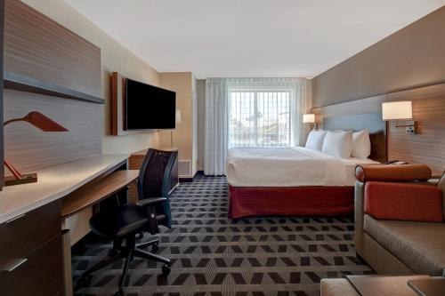
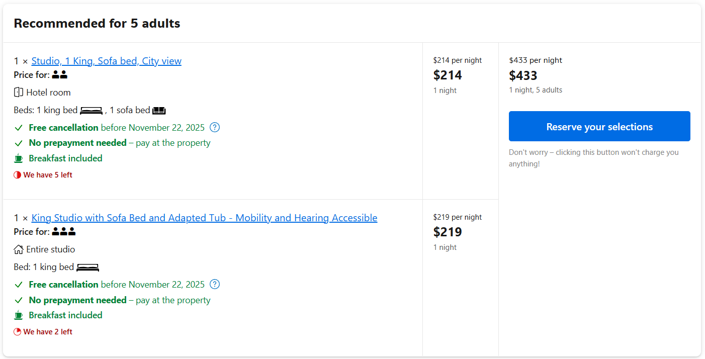
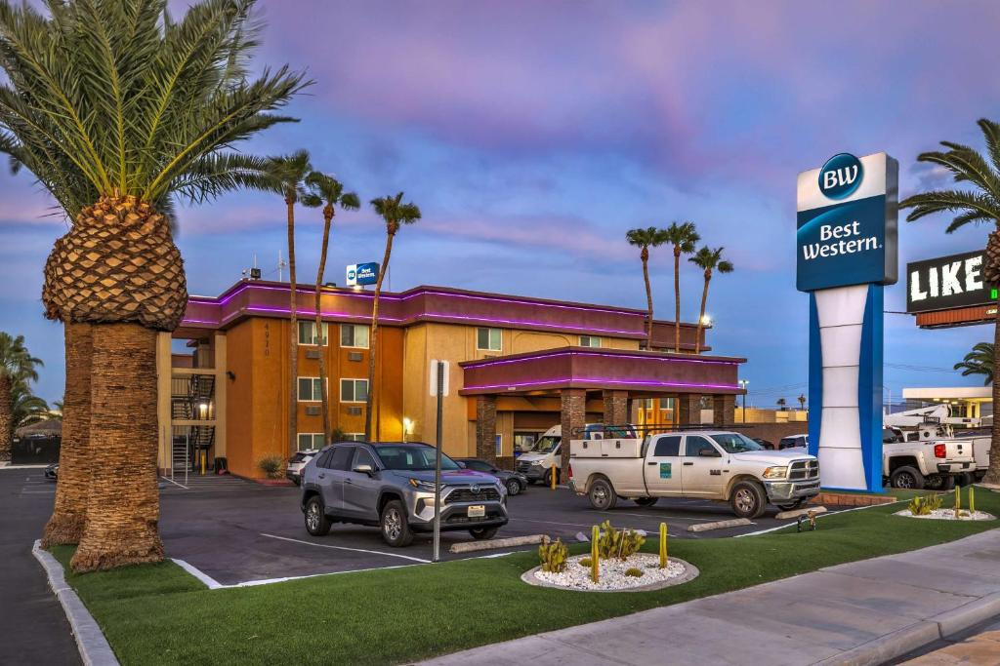
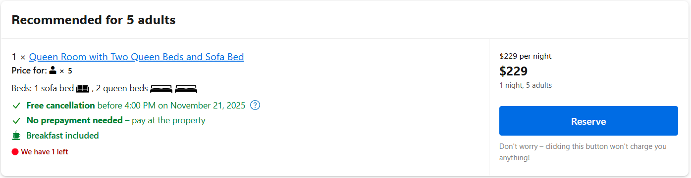
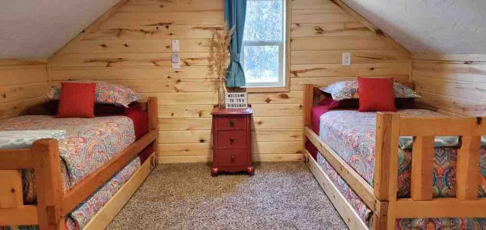
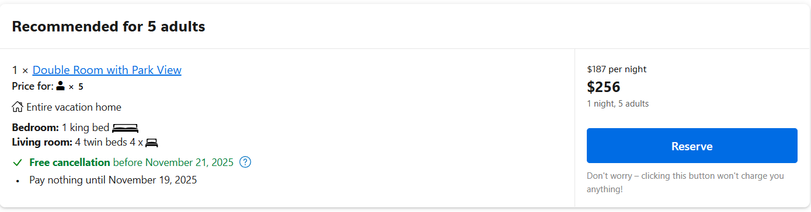
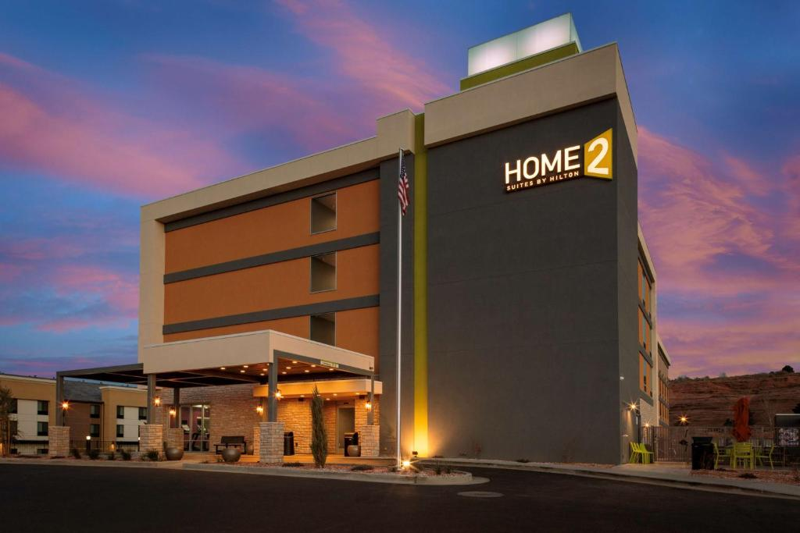
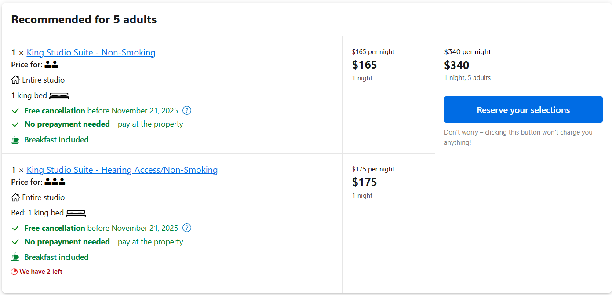
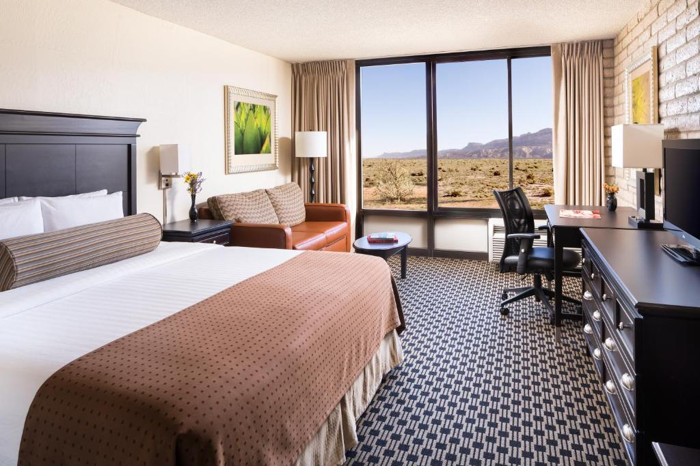
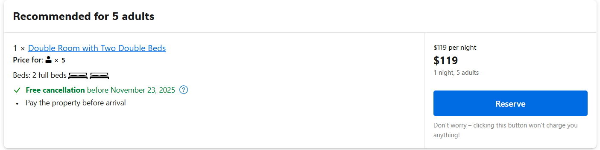

# Las Vegas & Utah Saturday 11.22 – Sunday 11.30

### 全程

<iframe src="https://www.google.com/maps/embed?pb=!1m64!1m12!1m3!1d1643184.7870347325!2d-114.00042622881561!3d36.44921102377613!2m3!1f0!2f0!3f0!3m2!1i1024!2i768!4f13.1!4m49!3e0!4m5!1s0x80c8cf60f29d3ca7%3A0x7e62d89e0ce1f750!2sHarry%20Reid%20Rental%20Car%20Center!3m2!1d36.0600388!2d-115.16460869999999!4m5!1s0x80cac4ede0e0b9d1%3A0x8017b530ed84020b!2sZion%20National%20Park%20Entrance%2C%20Utah!3m2!1d37.233187199999996!2d-112.875519!4m5!1s0x87356bc602c3eb2d%3A0x6be9d8fbbeac6d06!2sBryce%20Canyon%20National%20Park%2C%20Utah!3m2!1d37.5930377!2d-112.1870895!4m5!1s0x8734139684856e1f%3A0x2170c2722ad9e485!2sDixie&#39;s%20Lower%20Antelope%20Canyon%20Tours!3m2!1d36.9013214!2d-111.410263!4m5!1s0x87346ced52b21091%3A0xb623646960566829!2sHorseshoe%20Bend%2C%20Arizona!3m2!1d36.879061199999995!2d-111.5103627!4m5!1s0x87372e841bdd86a5%3A0x3eaaa99ad33bd890!2sMonument%20Valley%2C%20AZ!3m2!1d36.9913715!2d-110.1938672!4m5!1s0x80cc0654bd27e08d%3A0xb1c2554442d42e8d!2sGrand%20Canyon%2C%20Arizona!3m2!1d36.0997631!2d-112.1124846!4m5!1s0x80c8cf60f29d3ca7%3A0x7e62d89e0ce1f750!2sHarry%20Reid%20Rental%20Car%20Center!3m2!1d36.0600388!2d-115.16460869999999!5e0!3m2!1sen!2sus!4v1761789371816!5m2!1sen!2sus" width="600" height="450" style="border:0;" allowfullscreen="" loading="lazy" referrerpolicy="no-referrer-when-downgrade"></iframe>

## TODO
- [ ] 机票
- [ ] 确定住宿地点
  - [ ] 买睡袋
- [ ] Hertz 租车
- [ ] 看[天气](https://www.myforecast.com/30-day-forecast.php?cwid=gn5536630&metric=false&city_count=&zip_code=&condition=act&data=1067872117)（最低夜里可能-5℃）
- [ ] 准备行李
  - [ ] 证件（护照+驾照）
  - [ ] 衣服（冲锋衣/雨具）
  - [ ] 食物
  - [ ] 水
  - [ ] 无人机
  - [ ] starlink 热点 (30 days trial)
- [ ] 景区门票

## 总花费

| Item                     | Cost (for 5 people) | Notes                               |
|--------------------------|---------------------|-------------------------------------|
| 机票                     | $350/person        | 往返直飞 Las Vegas                  |
| 租车                     | $600（含保险）      | AWD SUV $80/day * 7 days        |
| 油费                     | $150                | 约1000 miles, 20mpg, $3.5/gallon     |
| 住宿                     | $2000               | 7晚, 平均$300/day, 2个房间或者suites   |
| 食物                     | $350/person         | 7天，$50 per day per person       |
| 门票                     | ~$100/person       |    羚羊谷                               |
| **Total**                | **~$1350/person**    |                                     |

## 住宿地点

- 11.22-11.23 Las Vegas
- 11.23-11.24 Springdale (Zion National Park)
  - OR Orderville [小木屋](https://www.eastzionresort.com/?_gl=1*ywwlj1*_gcl_au*MzU0MzY4OTkuMTc2MTc4NTgyNw..)
- 11.24-11.25 Bryce Canyon City (Bryce Canyon National Park)
- 11.25-11.26 Page (Antelope Canyon)
- 11.26-11.27 Monument Valley
- 11.27-11.28 Grand Canyon
- 11.28-11.29 Las Vegas

## 注意事项

## Saturday Nov. 22
### 行程

### 住宿 (Las Vegas, NV)

**Option 1: [TownePlace Suites Las Vegas Airport South](https://www.booking.com/hotel/us/towneplace-suites-las-vegas-airport-south.html?aid=318615&label=New_English_EN_IL%3A_Illinois_23537933665-BH7ZfGS_zB56FdolSKk6AgS634117833480%3Apl%3Ata%3Ap1%3Ap2%3Aac%3Aap%3Aneg%3Afi%3Atidsa-64415754265%3Alp9022196%3Ali%3Adec%3Adm%3Aag23537933665%3Acmp363165745&sid=e74941211d4fa29c295140d687ed3acd&all_sr_blocks=642960105_329267982_3_1_0%2C642960101_329267982_2_1_0&checkin=2025-11-22&checkout=2025-11-23&dest_id=12&dest_type=airport&dist=0&group_adults=5&group_children=0&hapos=5&highlighted_blocks=642960105_329267982_3_1_0%2C642960101_329267982_2_1_0&hpos=5&map=1&matching_block_id=642960105_329267982_3_1_0&no_rooms=2&req_adults=5&req_children=0&room1=A%2CA&room2=A%2CA%2CA&sb_price_type=total&sr_order=popularity&sr_pri_blocks=642960105_329267982_3_1_0__21900%2C642960101_329267982_2_1_0__21400&srepoch=1761792550&srpvid=7f1813cab60f0043&type=total&ucfs=1&#map_closed)**
~$433 2 rooms: (1 king + 1 sofa bed) * 2

**Option 2: [Best Western McCarran Inn](https://www.booking.com/hotel/us/best-western-mccarran-inn.html?aid=318615&label=New_English_EN_IL%3A_Illinois_23537933665-BH7ZfGS_zB56FdolSKk6AgS634117833480%3Apl%3Ata%3Ap1%3Ap2%3Aac%3Aap%3Aneg%3Afi%3Atidsa-64415754265%3Alp9022196%3Ali%3Adec%3Adm%3Aag23537933665%3Acmp363165745&sid=e74941211d4fa29c295140d687ed3acd&all_sr_blocks=7689918_378654051_5_1_0&checkin=2025-11-22&checkout=2025-11-23&dest_id=12&dest_type=airport&dist=0&group_adults=5&group_children=0&hapos=1&highlighted_blocks=7689918_378654051_5_1_0&hpos=1&map=1&matching_block_id=7689918_378654051_5_1_0&no_rooms=1&req_adults=5&req_children=0&room1=A%2CA%2CA%2CA%2CA&sb_price_type=total&sr_order=popularity&sr_pri_blocks=7689918_378654051_5_1_0__22899&srepoch=1761792658&srpvid=27a31407200c002f&type=total&ucfs=1&#map_closed)**
~$229 1 room with 2 queen + 1 sofa

## Sunday Nov. 23. (Zion National Park)
### 行程

### 住宿
**Option 1: [89nine](https://www.89nine.com/accommodations/)**
~$200

**Option 2: [The Hideaway Concealed Cabin East Zion & Bryce](https://www.booking.com/hotel/us/the-hideaway-concealed-cabin-east-zion-bryce.html?aid=2049340&label=arizona-2ujR7XydlmUNBwmxTkYhmwS629364173028%3Apl%3Ata%3Ap1%3Ap2%3Aac%3Aap%3Aneg%3Afi%3Atikwd-102373203%3Alp9022196%3Ali%3Adec%3Adm&sid=490865fa87131a422bb8cee87d43199d&all_sr_blocks=1165487602_399639476_5_0_0&checkin=2025-11-23&checkout=2025-11-24&dest_id=20133165&dest_type=city&dist=0&group_adults=5&group_children=0&hapos=1&highlighted_blocks=1165487602_399639476_5_0_0&hpos=1&matching_block_id=1165487602_399639476_5_0_0&no_rooms=1&req_adults=5&req_children=0&room1=A%2CA%2CA%2CA%2CA&sb_price_type=total&sr_order=popularity&sr_pri_blocks=1165487602_399639476_5_0_0__25600&srepoch=1761792211&srpvid=913512943dc408b9&type=total&ucfs=1&)**
~$256, 4 twin beds + 1 king

## Monday Nov. 24. (Bryce Canyon National Park)
### 行程

### 住宿: Bryce Canyon, UT

**Option 1: [Best Western PLUS Ruby's Inn](https://www.booking.com/hotel/us/bwri-bryce-canyon-city-utah.html?aid=2049340&label=arizona-2ujR7XydlmUNBwmxTkYhmwS629364173028%3Apl%3Ata%3Ap1%3Ap2%3Aac%3Aap%3Aneg%3Afi%3Atikwd-102373203%3Alp9022196%3Ali%3Adec%3Adm&sid=490865fa87131a422bb8cee87d43199d&all_sr_blocks=2225412_244924711_3_1_0%2C2225412_244924711_2_1_0&checkin=2025-11-24&checkout=2025-11-25&dest_id=20132714&dest_type=city&dist=0&group_adults=5&group_children=0&hapos=1&highlighted_blocks=2225412_244924711_3_1_0%2C2225412_244924711_2_1_0&hpos=1&matching_block_id=2225412_244924711_3_1_0&no_rooms=2&req_adults=5&req_children=0&room1=A%2CA&room2=A%2CA%2CA&sb_price_type=total&sr_order=popularity&sr_pri_blocks=2225412_244924711_3_1_0__13495%2C2225412_244924711_2_1_0__12495&srepoch=1761791588&srpvid=58bf11efaedb06fb&type=total&ucfs=1&)**

~$260

## Tuesday Nov. 25. (Antelope Canyon)
### 行程

### 住宿: Page, AZ

**Option 1: [Home2 Suites By Hilton ](https://www.booking.com/hotel/us/home2-suites-by-hilton-page-lake-powell.html?aid=2049340&label=arizona-2ujR7XydlmUNBwmxTkYhmwS629364173028%3Apl%3Ata%3Ap1%3Ap2%3Aac%3Aap%3Aneg%3Afi%3Atikwd-102373203%3Alp9022196%3Ali%3Adec%3Adm&sid=490865fa87131a422bb8cee87d43199d&all_sr_blocks=627645703_244504362_5_1_0_1069606&checkin=2025-11-26&checkout=2025-11-27&dest_id=20006816&dest_type=city&dist=0&group_adults=5&group_children=0&hapos=1&highlighted_blocks=627645703_244504362_5_1_0_1069606&hpos=1&matching_block_id=627645703_244504362_5_1_0_1069606&no_rooms=1&req_adults=5&req_children=0&room1=A%2CA%2CA%2CA%2CA&sb_price_type=total&sr_order=popularity&sr_pri_blocks=627645703_244504362_5_1_0_1069606_14783&srepoch=1761791222&srpvid=56a0113611f20170&type=total&ucfs=1&)**
~$340

**Option 2: [Motel 6-Page](https://www.booking.com/hotel/us/page.html?aid=2049340&label=arizona-2ujR7XydlmUNBwmxTkYhmwS629364173028%3Apl%3Ata%3Ap1%3Ap2%3Aac%3Aap%3Aneg%3Afi%3Atikwd-102373203%3Alp9022196%3Ali%3Adec%3Adm&sid=490865fa87131a422bb8cee87d43199d&all_sr_blocks=51746906_107703066_3_0_0_1208294%2C51746905_107703066_2_0_0_1208294&checkin=2025-11-26&checkout=2025-11-27&dest_id=20006816&dest_type=city&dist=0&group_adults=5&group_children=0&hapos=1&highlighted_blocks=51746906_107703066_3_0_0_1208294%2C51746905_107703066_2_0_0_1208294&hpos=1&matching_block_id=51746906_107703066_3_0_0_1208294&no_rooms=2&req_adults=5&req_children=0&room1=A%2CA&room2=A%2CA%2CA&sb_price_type=total&sr_order=popularity&sr_pri_blocks=51746906_107703066_3_0_0_1208294_5299%2C51746905_107703066_2_0_0_1208294_4999&srepoch=1761791456&srpvid=af4011aed34905cc&type=total&ucfs=1&)** 
 ~$103

## Wednesday Nov. 26. (Monument Valley)
### 行程

### 住宿

**Option 1: [Kayenta Monument Valley Inn](https://www.booking.com/hotel/us/kayenta-monument-valley-inn.html?aid=318615&label=New_English_EN_IL%3A_Illinois_23537933665-BH7ZfGS_zB56FdolSKk6AgS634117833480%3Apl%3Ata%3Ap1%3Ap2%3Aac%3Aap%3Aneg%3Afi%3Atidsa-64415754265%3Alp9022196%3Ali%3Adec%3Adm%3Aag23537933665%3Acmp363165745&sid=e74941211d4fa29c295140d687ed3acd&all_sr_blocks=42895402_412512829_0_0_0&checkin=2025-11-26&checkout=2025-11-27&dest_id=6604&dest_type=region&dist=0&group_adults=5&group_children=0&hapos=1&highlighted_blocks=42895402_412512829_0_0_0&hpos=1&matching_block_id=42895402_412512829_0_0_0&no_rooms=2&req_adults=5&req_children=0&room1=A%2CA&room2=A%2CA%2CA&sb_price_type=total&sr_order=popularity&sr_pri_blocks=42895402_412512829_0_0_0__11900&srepoch=1761792899&srpvid=cd7f147c28ce067c&type=total&ucfs=1&)**
~$119 per room (2 full bed)

## Thursday Nov. 27. (Grand Canyon)
### 行程

### 住宿
**Option 1: [Hampton Inn by hilton Williams](https://www.booking.com/hotel/us/hampton-inn-by-hilton-williams.html?aid=318615&label=New_English_EN_IL%3A_Illinois_23537933665-BH7ZfGS_zB56FdolSKk6AgS634117833480%3Apl%3Ata%3Ap1%3Ap2%3Aac%3Aap%3Aneg%3Afi%3Atidsa-64415754265%3Alp9022196%3Ali%3Adec%3Adm%3Aag23537933665%3Acmp363165745&sid=e74941211d4fa29c295140d687ed3acd&all_sr_blocks=893909505_359800740_3_1_0_1035021%2C893909503_359800740_2_1_0_1035021&checkin=2025-11-27&checkout=2025-11-28&dest_id=3615&dest_type=region&dist=0&group_adults=5&group_children=0&hapos=5&highlighted_blocks=893909505_359800740_3_1_0_1035021%2C893909503_359800740_2_1_0_1035021&hpos=5&matching_block_id=893909505_359800740_3_1_0_1035021&no_rooms=2&req_adults=5&req_children=0&room1=A%2CA&room2=A%2CA%2CA&sb_price_type=total&sr_order=popularity&sr_pri_blocks=893909505_359800740_3_1_0_1035021_12634%2C893909503_359800740_2_1_0_1035021_11655&srepoch=1761793002&srpvid=42a314a745b10673&type=total&ucfs=1&)**
~$243 for 2 rooms (2 queen each)

## Friday Nov. 28. (Return to Las Vegas)
### 行程

### 住宿

## Saturday Nov. 29. (Las Vegas to UIUC)
### 行程

### 住宿

## Sunday Nov. 30.
### 行程

### 住宿

